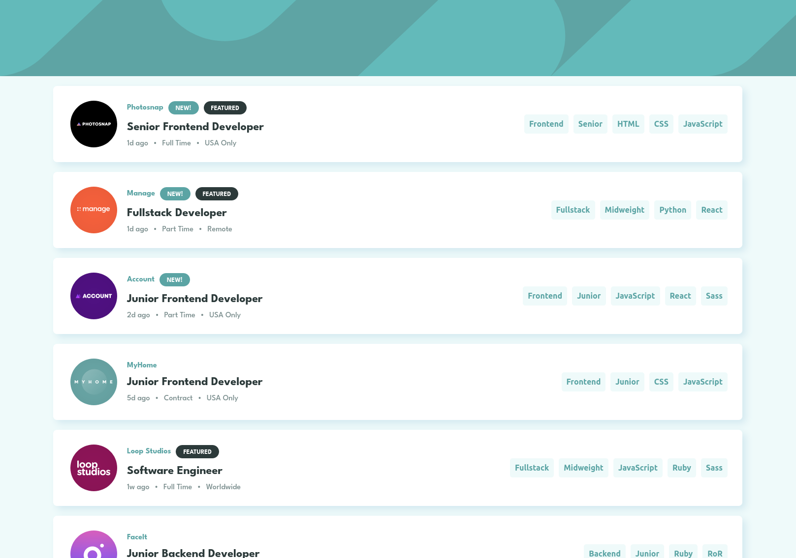
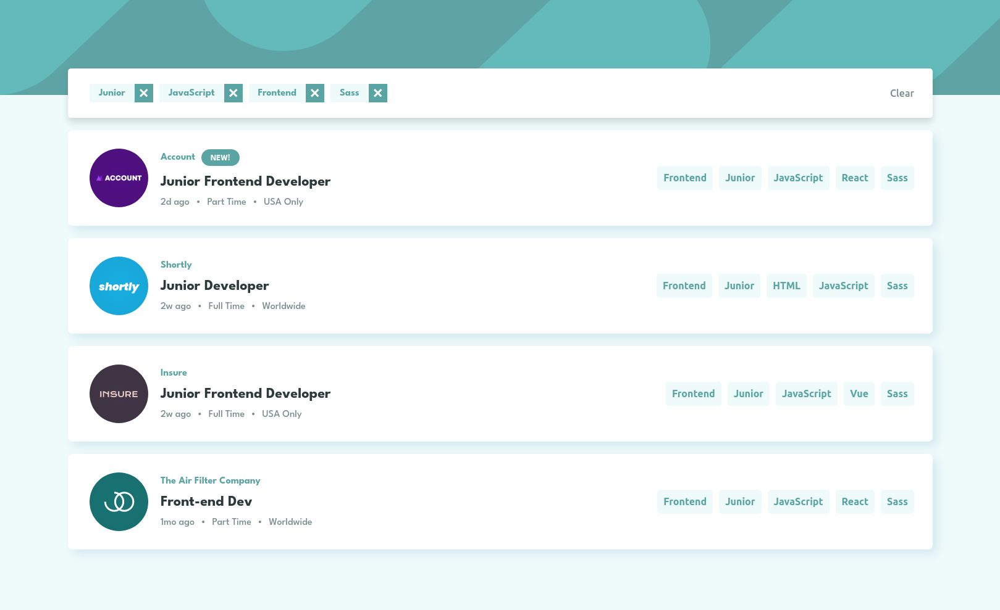
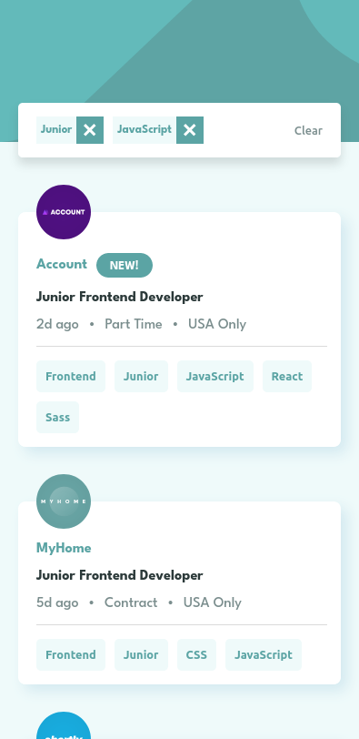

# Frontend Mentor - Job listings with filtering solution

This is a solution to the [Job listings with filtering challenge on Frontend Mentor](https://www.frontendmentor.io/challenges/job-listings-with-filtering-ivstIPCt).

### Links

[- My solution live URL:](https://dan77uk.github.io/joblistings/)

## Table of contents

- [Overview](#overview)
  - [The challenge](#the-challenge)
  - [My Solution Screenshot](#screenshot)
  - [Links](#links)
- [My process](#my-process)
  - [Built with](#built-with)
  - [What I learned](#what-i-learned)
- [Author](#author)


## Overview

### The challenge

The challenge was to build out this landing page and get it looking as close to the supplied design as possible.


Users should be able to:

- View the optimal layout for the site depending on their device's screen size
- See hover states for all interactive elements on the page
- Filter job listings based on the categories

### My Solution Screenshots

Desktop




Desktop Active Filter




Mobile Active Filter



## My process

### Built with

- Semantic HTML5 markup
- Flexbox
- Mobile-first workflow
- [React](https://reactjs.org/) - JS library

### What I learned

The project was simple to make thanks to React. I split the app into two components; individual job listings (Job.js) and a tab component for the filter catagories (Tab.js). I also used ternery operators in a few areas to determine if certain conditions were true;

For instance, if the user had selected a filter catagory (populating the filterCatagory array held in state), my app displays the filter bar:

```js
{filterCategories.length > 0 ? /* displays filter bar */ : ''
}
```

Or to check whether the boolean 'New' or 'Featured values were true:

```js
{data.new ? <span className='tab blue'>NEW!</span> : ''}
{data.featured ? <span className='tab black'>FEATURED</span> : ''}
```

The most challenging aspect was displaying the filtered data once catagories had been selected. However I solved this by making the filterCatagories array a dependency of the useEffect hook, and that re-rendered on each catagory addition or deletion, keeping the DOM up-to-date:

```js
  useEffect(hook, [jobs, filterCategories])
  ...
  const res = jobs.filter((job) => 
    filterCategories.every((catagory) => 
      Object.values(job).includes(catagory) || Object.values(job.tools).includes(catagory) || Object.values(job.languages).includes(catagory)
    )
  )
```

## Author

- LinkedIn - [Dan Phillips](https://www.linkedin.com/in/dan-phillips-845a1b205/)


